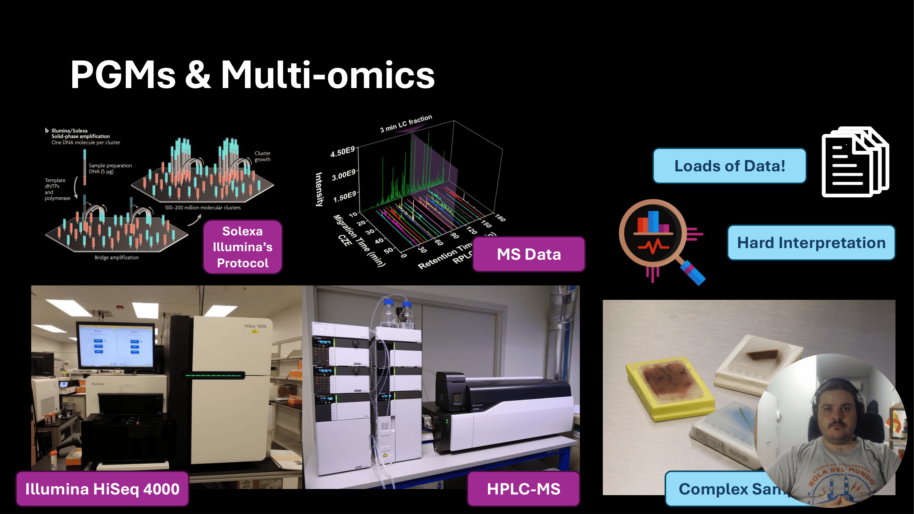
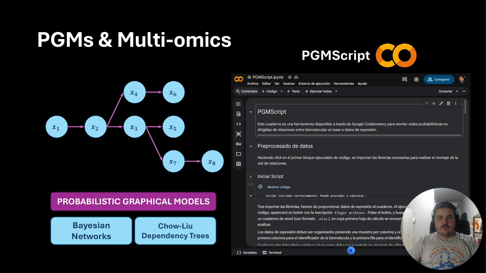
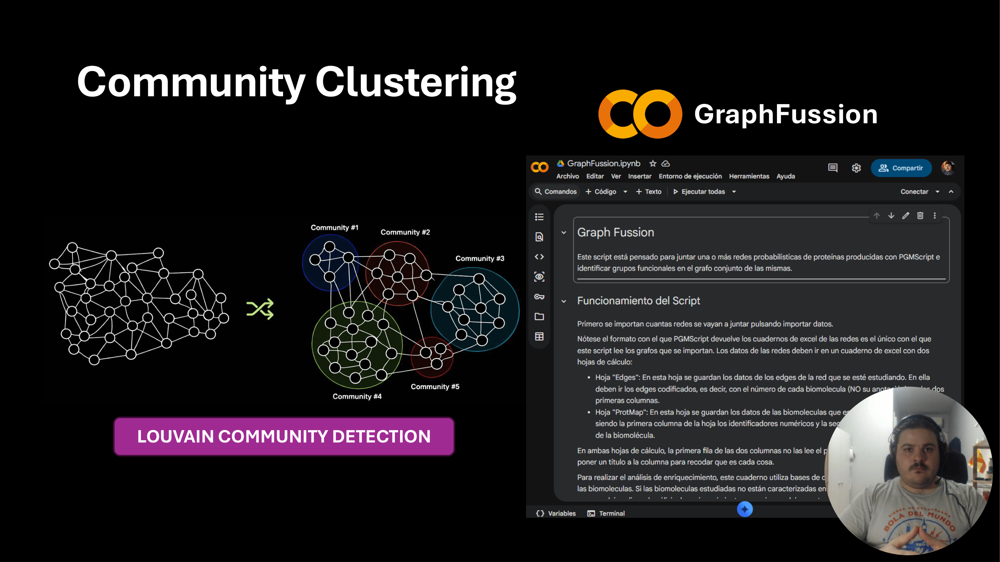
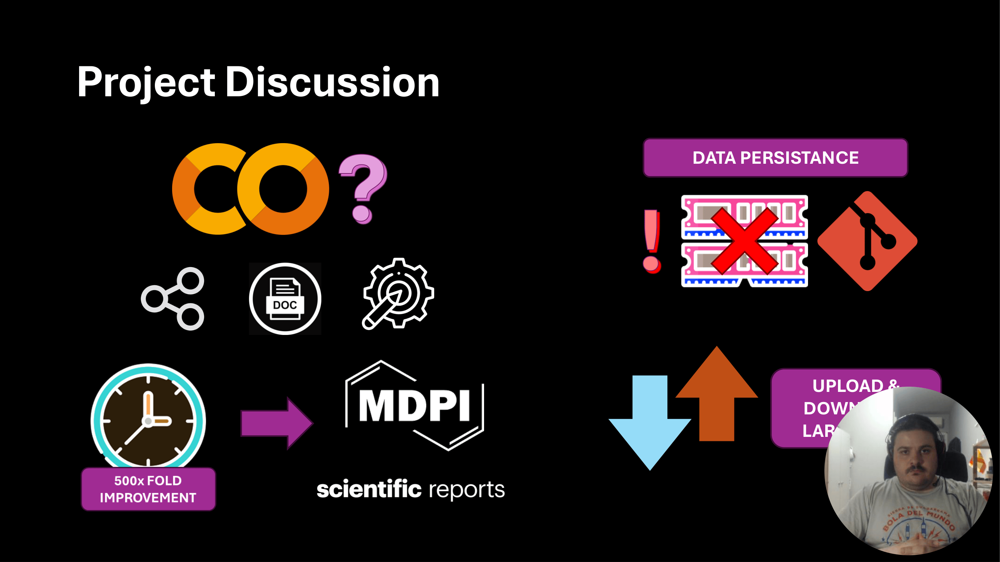

# Demo — PGMs & Multi-omics on Google Cloud (Hospital Universitario La Paz)

This demo describes a project I built during my internship at **Hospital Universitario La Paz (Madrid)**, in the **Molecular Oncology Lab**, where we analyzed tumor samples and multi-omics data.

---

## 1) Context: Multi-omics in a Molecular Oncology Lab

  

At the lab we analyzed **tumor samples embedded in paraffin blocks** and applied **multi-omics** techniques—high-throughput measurement methods that generate large volumes of data.

Examples included:

- **RNA-seq**: sequencing the transcriptome of a sample (e.g., using Illumina platforms).
- **Proteomics**: measuring proteins present in a sample (e.g., using mass spectrometers / HPLC-MS).

The major advantage is the richness of the data, but the cost is that it can be **hard to interpret** reliably and efficiently.

---

## 2) Existing approach: Probabilistic Graphical Models (PGMs)

  

The lab already had a pipeline to relate expression levels between transcripts/proteins using **probabilistic graphical models**, mainly:

- **Chow–Liu dependency trees**, conceptually similar to Bayesian networks for capturing dependencies.

My task was to **re-implement and operationalize** this analysis workflow so that it could be used by colleagues who were less comfortable with programming—through an **intuitive, shareable UI**.

---

## 3) Why Google Cloud notebooks?

A key practical constraint was the hospital’s **restricted internet access** in the lab environment (proxy limitations). This made it difficult to:

- install or update Python packages,
- work efficiently with external dependencies,
- reproduce environments reliably.

Moving the workflow to **Google Cloud notebooks** made sense because:

- notebooks are easy to **share** and **document**,
- compute resources can be **allocated dynamically** as needed,
- it helped **circumvent proxy limitations** in day-to-day work.

---

## 4) Main contribution: Graph Fusion (community detection)

  

My main contribution was developing **Graph Fusion**: a script that automates the process of creating **clusters of functionally-related nodes**.

Before this, clustering was performed manually, taking roughly **three weeks** of someone’s time.

I implemented the **Louvain community detection algorithm**, achieving roughly a:

- **500× time improvement**, reducing the task to about **one hour**.

This automation made the workflow much more scalable and repeatable.

---

## 5) Results, impact, and remaining issues

  

The notebook-based workflow (including Graph Fusion) delivered meaningful improvements:

- **~500× speedup** in the clustering step,
- a pipeline that is easier to **use, share, and maintain**,
- the work is **already yielding scientific results**, contributing to publications (e.g., MDPI, Scientific Reports).

One remaining limitation is **data persistence** in notebook environments: if a runtime resets, local data may be erased. To mitigate this, I established a **git repository** containing essential databases that can be re-downloaded each run—though users still need to upload/download their experiment-specific datasets, which can be large.

---

## 6) Closing

This project was the focus of the first months of my internship at Hospital Universitario La Paz. It helped my lab colleagues immediately, and it continues to produce results; it also contributed to me obtaining a **research assistant contract** alongside my internship.

Thanks for watching this demo.
